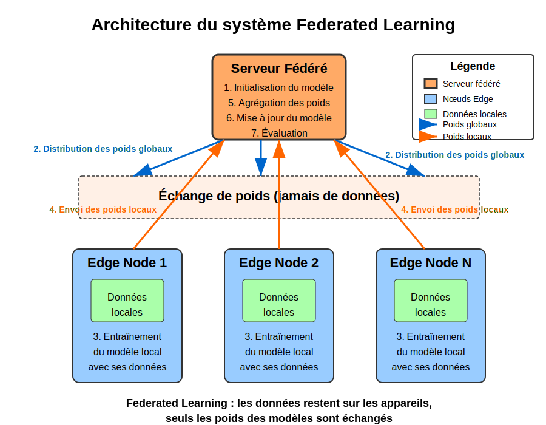

# Projet d'Apprentissage Fédéré sur MNIST

Ce projet explore différentes implémentations et optimisations d'algorithmes d'apprentissage fédéré appliqués au dataset MNIST. L'apprentissage fédéré permet d'entraîner des modèles de machine learning sur des données distribuées sans centraliser ces données, préservant ainsi la confidentialité et réduisant les coûts de communication.



## Table des matières

1. [Introduction](#introduction)
2. [Structure du projet](#structure-du-projet)
3. [Contributeurs et leurs travaux](#contributeurs-et-leurs-travaux)
4. [Installation et configuration](#installation-et-configuration)
5. [Exécution des différentes implémentations](#exécution-des-différentes-implémentations)
6. [Résultats et analyses](#résultats-et-analyses)

## Introduction

L'apprentissage fédéré est une approche d'entraînement des modèles de machine learning où les données restent sur les appareils des utilisateurs (ou "edges"). Au lieu de centraliser les données brutes, seuls les mises à jour des modèles (poids) sont envoyées à un serveur central qui les agrège pour créer un modèle global amélioré.

Dans ce projet, nous explorons plusieurs variantes d'algorithmes d'apprentissage fédéré, notamment:
- FedAvg (Federated Averaging)
- FedProx (Federated Proximal)
- FedProx avec μ adaptatif
- FedSGD (Federated Stochastic Gradient Descent)

Ces algorithmes sont testés et comparés sur le dataset MNIST des chiffres manuscrits, avec différentes configurations pour explorer leur comportement dans des scénarios variés (distribution IID et non-IID des données, nombre variable d'edges, etc.).

## Structure du projet

Le projet est organisé autour de plusieurs modules complémentaires :

- **Modules de base**:
  - `fl_model.py`: Définition du modèle neural utilisé
  - `fl_dataquest.py`: Chargement et prétraitement des données MNIST
  - `edge_node.py`: Implémentation des nœuds edge standards
  - `federated_server.py`: Serveur central pour l'agrégation des modèles

- **Modules d'optimisation**:
  - `fedprox_model.py`: Modèle adapté pour FedProx
  - `adaptive_edge_node.py`: Nœuds edge avec μ adaptatif 
  - `adaptive_federated_server.py`: Serveur adapté pour le μ adaptatif
  - `adaptive_mu_calculator.py`: Calcul dynamique du paramètre μ
  - `fedsgd_implementation.py`: Implémentation de FedSGD

- **Scripts d'expérimentation**:
  - `main_experimentation.py`: Comparaison FedAvg et FedProx
  - `run_adaptive_fedprox.py`: Tests avec μ adaptatif
  - `run_comparaison_with_fedsgv.py`: Comparaison avec FedSGD
  - `federated_learning_dylan.py`: Implémentation optimisée avec diverses techniques

- **Ressources**:
  - `ressource_image/fl.svg`: Schéma d'architecture
  - Dossier `figures/`: Résultats graphiques générés

## Contributeurs et leurs travaux

### Florian
**Fichiers**: 
- `edge_node.py`
- `federated_server.py`
- `readme_edge_Florian.md`

**Description**: Implémentation de base du système d'apprentissage fédéré avec une architecture client-serveur. Son travail couvre les nœuds edge standard qui chargent leurs propres données et le serveur central pour l'agrégation des modèles. Son README détaille l'architecture générale du système d'apprentissage fédéré et les principes fondamentaux.

### Dylan
**Fichiers**: 
- `federated_learning_dylan.py`
- `readme_federated_learning_dylan.md`

**Description**: Version optimisée de l'apprentissage fédéré avec de nombreuses améliorations: distribution stratégique des données, taux d'apprentissage adaptatif, implémentation de FedProx, techniques de régularisation, momentum pour stabiliser l'apprentissage, détection des contributeurs anormaux. Son README explique les optimisations et propose des voies d'amélioration.

### Thibault
**Fichiers**: 
- `comparaison_thibault/main_experimentation.py`
- `comparaison_thibault/run_adaptive_fedprox.py`
- `comparaison_thibault/run_comparaison_with_fedsgv.py`
- `comparaison_thibault/adaptive_edge_node.py`
- `comparaison_thibault/adaptive_federated_server.py`
- `comparaison_thibault/adaptive_mu_calculator.py`
- `comparaison_thibault/fedprox_model.py`
- `comparaison_thibault/fedsgd_implementation.py`
- `comparaison_thibault/readme_comparaison.md`
- `comparaison_thibault/readme.md`

**Description**: Implémentation et comparaison approfondie des algorithmes FedAvg, FedProx, FedProx avec μ adaptatif et FedSGD. Son travail inclut des scripts d'expérimentation permettant d'évaluer l'impact de différents paramètres (nombre d'edges, distribution des données, μ dans FedProx). Il a également développé une version innovante de FedProx avec μ adaptatif qui s'ajuste dynamiquement en fonction des caractéristiques des données locales.

### Nicolas 
**Fichiers**:
- `README_Nicolas.md`

**Description**: Analyse théorique des défis de l'apprentissage fédéré et des alternatives possibles. Son README présente une vision globale des limites actuelles (hétérogénéité des données, problèmes de communication, sécurité, confidentialité) et des algorithmes alternatifs avancés (FedMA, FedPAQ, DP-FedAvg, Gossip Learning).

### Projet initial et autres fichiers
**Fichiers**: 
- `fl_model.py`
- `fl_dataquest.py`
- `edge_sim.py`

**Description**: Modules fondamentaux pour créer le modèle neural, charger et prétraiter les données MNIST. `edge_sim.py` contient une implémentation de référence de FedAvg.

## Installation et configuration

1. Clonez ce dépôt
```bash
git clone https://github.com/votre-username/federated-learning-project.git
cd federated-learning-project
```

2. Installez les dépendances requises
```bash
pip install tensorflow numpy matplotlib scikit-learn imutils opencv-python
```

3. Téléchargez le dataset MNIST au format JPEG depuis Kaggle:
   - Rendez-vous sur https://www.kaggle.com/datasets/scolianni/mnistasjpg
   - Téléchargez et extrayez le fichier ZIP
   - Notez le chemin vers le dossier `trainingSet`

## Exécution des différentes implémentations

### Implémentation de base

```bash
python edge_sim.py
```

### Version optimisée de Dylan

```bash
python federated_learning_dylan.py
```

### Expérimentations de Thibault

Pour comparer FedAvg et FedProx:
```bash
python comparaison_thibault/main_experimentation.py
```

Pour tester FedProx avec μ adaptatif:
```bash
python comparaison_thibault/run_adaptive_fedprox.py
```

Pour comparer avec FedSGD:
```bash
python comparaison_thibault/run_comparaison_with_fedsgv.py
```

## Résultats et analyses

Les expérimentations montrent que:

1. **FedAvg vs FedProx**: FedProx surpasse généralement FedAvg dans les scénarios avec distribution non-IID des données, grâce à sa régularisation proximale qui limite la divergence des modèles locaux.

2. **FedProx avec μ adaptatif**: La version adaptative de FedProx montre des performances supérieures en ajustant dynamiquement le paramètre μ en fonction des caractéristiques des données locales et de l'évolution de l'entraînement.

3. **Impact de la distribution non-IID**: Plus la distribution des données est hétérogène entre les edges, plus l'avantage de FedProx sur FedAvg est important.

4. **Optimisations**: Les techniques d'optimisation (distribution stratégique des données, taux d'apprentissage adaptatif, momentum) améliorent considérablement les performances des modèles fédérés.

5. **Comparaison avec le modèle centralisé**: Malgré les améliorations, un écart de performance persiste entre les approches fédérées et l'apprentissage centralisé traditionnel, ce qui représente le coût inhérent à la préservation de la confidentialité des données.

Pour plus de détails sur les résultats spécifiques, consultez les READMEs individuels des contributeurs et les graphiques générés dans le dossier `figures/`.