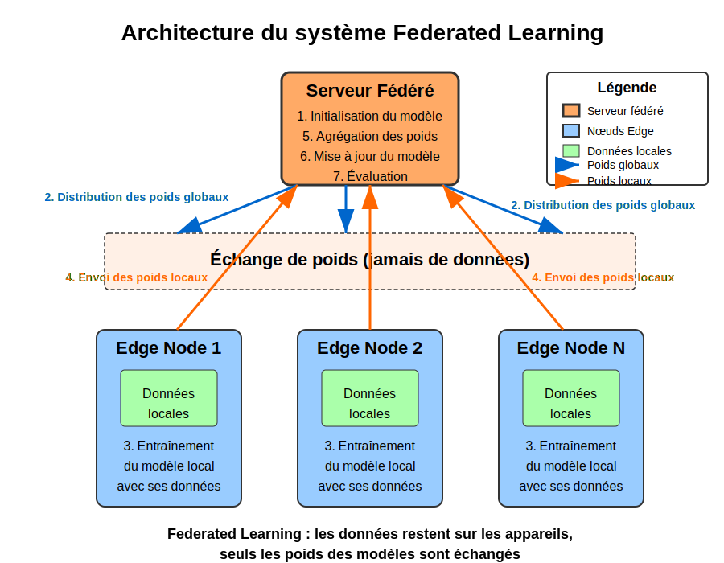

# Federated Learning avec approvisionnement des données par les edges

## Table des matières
1. [Introduction et contexte](#introduction-et-contexte)
2. [Architecture du système](#architecture-du-système)
3. [Composants clés](#composants-clés)
    - [EdgeNode](#edgenode)
    - [FederatedServer](#federatedserver)
    - [Processus d'apprentissage fédéré](#processus-dapprentissage-fédéré)
4. [Points importants de l'implémentation](#points-importants-de-limplémentation)
5. [Analyse des résultats](#analyse-des-résultats)
6. [Défis et limites](#défis-et-limites)
7. [Améliorations possibles](#améliorations-possibles)
8. [Conclusion](#conclusion)

## Introduction et contexte

Le Federated Learning (FL) est une approche d'apprentissage automatique qui permet d'entraîner un modèle sur plusieurs appareils ou serveurs détenant des données locales, sans avoir à centraliser ces données. Cette technique répond à plusieurs problématiques :
- Protection de la vie privée et confidentialité des données
- Réglementation (comme le RGPD) concernant le transfert et le stockage de données
- Volume de données trop important pour être centralisé efficacement
- Réduction des coûts de bande passante

Ce projet implémente une approche de Federated Learning où les "edges" (nœuds périphériques) sont responsables de charger leurs propres données, similaire à un cas réel où les données restent sur les appareils de l'utilisateur et ne sont jamais centralisées.

Le dataset utilisé est MNIST, qui contient des images de chiffres manuscrits de 0 à 9. Notre implémentation permet à chaque edge de ne charger qu'un sous-ensemble de classes (chiffres), simulant un scénario réel où différents appareils disposent de données différentes.

## Architecture du système

L'architecture du système est composée de deux principales entités :

1. **Serveur central (FederatedServer)** : Responsable de l'initialisation du modèle global, de l'agrégation des poids des modèles locaux et de l'évaluation du modèle global.

2. **Nœuds périphériques (EdgeNode)** : Responsables de charger leurs propres données, d'entraîner des modèles locaux avec les poids initiaux fournis par le serveur, et de renvoyer les poids mis à jour au serveur.

La communication entre le serveur central et les nœuds périphériques se fait uniquement par l'échange de poids du modèle, jamais par l'échange de données brutes.

Le processus global suit l'algorithme FedAvg (Federated Averaging), où les poids des modèles locaux sont agrégés proportionnellement à la quantité de données traitées par chaque edge.



## Composants clés

### EdgeNode

La classe `EdgeNode` représente un nœud périphérique dans notre système d'apprentissage fédéré. Ses responsabilités principales sont :

1. **Chargement des données** : Chaque edge charge ses propres données à partir d'un sous-ensemble aléatoire de classes MNIST.
```python
def load_data(self, num_classes=10, folders_per_edge=None):
    # Si aucune liste de dossiers n'est fournie, choisissez aléatoirement
    if self.data_folders is None:
        if folders_per_edge is None:
            folders_per_edge = random.randint(1, num_classes)
        # Choisir aléatoirement des dossiers (classes)
        all_folders = [str(i) for i in range(num_classes)]
        self.data_folders = random.sample(all_folders, folders_per_edge)
    
    # Collecter tous les chemins d'images et les labels correspondants
    all_image_paths = []
    all_labels = []
    
    for folder in self.data_folders:
        folder_path = os.path.join(self.base_path, folder)
        if os.path.exists(folder_path):
            # Obtenir tous les fichiers d'images dans ce dossier
            image_files = [os.path.join(folder_path, f) for f in os.listdir(folder_path) 
                           if os.path.isfile(os.path.join(folder_path, f))]
            all_image_paths.extend(image_files)
            # Stocker directement les labels (folder contient déjà le chiffre)
            all_labels.extend([int(folder)] * len(image_files))
```

2. **Entraînement du modèle local** : L'edge utilise ses données locales pour entraîner une copie du modèle global.
```python
def train_model(self, global_model_weights, input_shape, num_classes=10, epochs=1):
    # Initialiser le modèle local avec les poids du modèle global
    self.model = fl_model.MyModel(input_shape, nbclasses=num_classes)
    self.model.set_weights(global_model_weights)
    
    # Entraîner le modèle local
    self.model.fit_it(trains=self.dataset, epochs=epochs, tests=None, verbose=self.verbose)
    
    # Retourner les poids du modèle local
    return self.model.get_weights()
```

Points notables :
- Chaque edge ne voit qu'un sous-ensemble des classes, simulant un scénario de données non IID (non indépendamment et identiquement distribuées).
- Les données sont prétraitées et converties en format one-hot encoding pour les labels.
- Le modèle local est initialisé avec les poids du modèle global avant chaque round d'entraînement.

### FederatedServer

La classe `FederatedServer` représente le serveur central qui coordonne l'apprentissage fédéré. Ses responsabilités principales sont :

1. **Initialisation du modèle global** : Créer et initialiser le modèle qui sera distribué aux edges.
```python
def initialize_model(self):
    return self.global_model.get_weights()
```

2. **Agrégation des poids** : Combiner les poids des modèles locaux en utilisant une moyenne pondérée basée sur la quantité de données de chaque edge.
```python
def aggregate_weights(self, edge_weights_list, edge_sample_counts):
    # Calculer le nombre total d'échantillons
    total_samples = sum(edge_sample_counts)
    
    # Calculer les poids agrégés pondérés par le nombre d'échantillons
    aggregated_weights = []
    
    # Pour chaque couche du modèle
    for layer_index in range(len(edge_weights_list[0])):
        layer_weights = []
        
        # Pour chaque edge
        for edge_index in range(len(edge_weights_list)):
            # Obtenir les poids de cette couche pour cet edge
            edge_layer_weights = edge_weights_list[edge_index][layer_index]
            
            # Pondérer ces poids par la proportion d'échantillons
            weight_factor = edge_sample_counts[edge_index] / total_samples
            weighted_weights = edge_layer_weights * weight_factor
            
            layer_weights.append(weighted_weights)
        
        # Sommer tous les poids pondérés pour cette couche
        aggregated_layer_weights = sum(layer_weights)
        aggregated_weights.append(aggregated_layer_weights)
    
    return aggregated_weights
```

3. **Évaluation du modèle global** : Mesurer les performances du modèle agrégé sur un jeu de données de test.
```python
def evaluate_global_model(self):
    if self.test_dataset is None:
        raise ValueError("Aucun dataset de test n'a été défini. Appelez set_test_data() d'abord.")
    
    return self.global_model.evaluate(self.test_dataset, verbose=self.verbose)
```

Points notables :
- L'agrégation des poids suit l'algorithme FedAvg, où chaque modèle local contribue proportionnellement à la quantité de données qu'il a traitées.
- Le serveur ne voit jamais les données brutes des edges, seulement les poids des modèles.
- Le serveur maintient un dataset de test séparé pour évaluer les performances du modèle global.

### Processus d'apprentissage fédéré

La fonction `run_federated_learning` orchestre le processus complet d'apprentissage fédéré :

```python
def run_federated_learning(mnist_base_path, test_dataset, num_edges=10, num_rounds=5, 
                          edge_epochs=1, input_shape=(28, 28), num_classes=10, verbose=1):
    # Initialiser le serveur
    server = FederatedServer(input_shape, num_classes, verbose)
    server.set_test_data(test_dataset)
    
    # Initialiser les edges
    edges = []
    for i in range(num_edges):
        edge = EdgeNode(f"edge_{i}", mnist_base_path, verbose=verbose)
        edges.append(edge)
    
    # Charger les données pour chaque edge
    for edge in edges:
        edge.load_data(num_classes, folders_per_edge=max(2, random.randint(1, num_classes // 2)))
    
    # Historique des évaluations
    evaluation_history = []
    
    # Exécuter les rounds de fédération
    for round_num in range(num_rounds):
        # Obtenir les poids du modèle global actuel
        global_weights = server.initialize_model() if round_num == 0 else server.global_model.get_weights()
        
        # Entraîner chaque edge avec les poids globaux actuels
        edge_weights_list = []
        edge_sample_counts = []
        
        for edge in edges:
            # Entraîner le modèle local de cet edge
            edge_weights = edge.train_model(global_weights, input_shape, num_classes, edge_epochs)
            edge_weights_list.append(edge_weights)
            edge_sample_counts.append(edge.get_sample_count())
        
        # Agréger les poids des modèles locaux
        aggregated_weights = server.aggregate_weights(edge_weights_list, edge_sample_counts)
        
        # Mettre à jour le modèle global
        server.update_global_model(aggregated_weights)
        
        # Évaluer le modèle global
        loss, accuracy = server.evaluate_global_model()
        evaluation_history.append((loss, accuracy))
    
    return evaluation_history
```

Étapes clés du processus :
1. Initialisation du serveur et des edges
2. Chargement des données par chaque edge
3. Pour chaque round de fédération :
   - Distribution des poids du modèle global aux edges
   - Entraînement des modèles locaux sur chaque edge
   - Agrégation des poids des modèles locaux en un modèle global
   - Évaluation du modèle global

## Points importants de l'implémentation

### 1. Distribution non-IID des données

Un aspect important de cette implémentation est la simulation d'une distribution non-IID des données, ce qui est plus réaliste dans les scénarios de Federated Learning. Chaque edge ne charge qu'un sous-ensemble aléatoire des classes MNIST :

```python
edge.load_data(num_classes, folders_per_edge=max(2, random.randint(1, num_classes // 2)))
```

Cela signifie que certains edges peuvent voir uniquement les chiffres 0, 1 et 2, tandis que d'autres peuvent voir les chiffres 5, 6, 7 et 8, par exemple. Cette hétérogénéité des données est un défi majeur dans les applications réelles de FL.

### 2. Pondération par taille du dataset

Dans l'algorithme FedAvg, les contributions des edges sont pondérées par la quantité de données qu'ils possèdent :

```python
weight_factor = edge_sample_counts[edge_index] / total_samples
weighted_weights = edge_layer_weights * weight_factor
```

Cela assure que les edges avec plus de données ont une influence plus importante sur le modèle global, ce qui est généralement souhaitable pour minimiser la fonction de perte globale.

### 3. Préservation de la confidentialité des données

Une caractéristique fondamentale du Federated Learning est que les données brutes ne quittent jamais leurs sources. Dans notre implémentation, seuls les poids des modèles sont partagés entre les edges et le serveur :

```python
# Entraîner le modèle local
edge_weights = edge.train_model(global_weights, input_shape, num_classes, edge_epochs)
edge_weights_list.append(edge_weights)
```

### 4. Comparaison avec l'apprentissage centralisé

La fonction `compare_with_centralized` permet de comparer directement les performances de l'apprentissage fédéré avec celles d'un apprentissage centralisé traditionnel :

```python
def compare_with_centralized(mnist_base_path, num_edges=10, num_rounds=5, edge_epochs=1, verbose=1):
    # ... [code omis pour brièveté]
    
    # Exécuter l'apprentissage fédéré
    fed_history = run_federated_learning(...)
    
    # Entraîner un modèle centralisé pour comparaison
    central_model = fl_model.MyModel(input_shape, nbclasses=10)
    central_model.fit_it(trains=train_dataset, epochs=num_rounds * edge_epochs, tests=test_dataset, verbose=verbose)
    
    # ... [code omis pour brièveté]
```

Cette comparaison est essentielle pour évaluer le compromis entre la confidentialité des données et la performance du modèle.

## Analyse des résultats

Les résultats de l'exécution du code montrent plusieurs aspects intéressants du Federated Learning :

### Performance du modèle fédéré vs. centralisé

```
Modèle centralisé - Perte: 0.2211, Précision: 0.9369
Modèle fédéré - Perte: 1.8600, Précision: 0.5707
```

On observe une différence significative entre les performances du modèle centralisé (93.7% de précision) et du modèle fédéré (57.1% de précision). Cette différence peut être attribuée à plusieurs facteurs :

1. **Distribution non-IID des données** : Chaque edge ne voit qu'un sous-ensemble des classes, ce qui peut conduire à un biais local et à une généralisation difficile.
2. **Nombre limité de rounds d'apprentissage** : Avec seulement 5 rounds, le modèle fédéré n'a peut-être pas eu suffisamment d'itérations pour converger.
3. **Une seule époque par edge et par round** : Les modèles locaux ne sont pas entraînés jusqu'à convergence avant l'agrégation.

### Évolution de l'apprentissage

Les graphiques montrent l'évolution de la perte et de la précision au fil des rounds :


On observe :
- Une diminution progressive de la perte du modèle fédéré, mais qui reste bien supérieure à celle du modèle centralisé.
- Une augmentation régulière de la précision du modèle fédéré, passant d'environ 37% au premier round à 57% au cinquième round.
- Le modèle fédéré semble continuer à s'améliorer, ce qui suggère qu'avec plus de rounds, il pourrait potentiellement se rapprocher des performances du modèle centralisé.

### Distribution des données entre les edges

Les logs d'exécution montrent comment les données sont réparties entre les edges :

```
Edge edge_0 va charger les classes: ['6', '0', '8']
Edge edge_0 a chargé 12332 échantillons
Edge edge_1 va charger les classes: ['4', '9', '0', '2']
Edge edge_1 a chargé 16569 échantillons
...
```

Cette hétérogénéité des données est un facteur important qui influence la performance du modèle fédéré.

## Défis et limites

### 1. Convergence plus lente

Le modèle fédéré converge plus lentement que le modèle centralisé, nécessitant potentiellement plus de rounds pour atteindre une précision comparable.

### 2. Distribution non-IID

La distribution non-IID des données présente un défi majeur pour l'apprentissage fédéré, car chaque edge peut développer un biais vers ses propres classes.

### 3. Surapprentissage local

Les modèles locaux peuvent souffrir de surapprentissage sur leurs données locales, surtout s'ils ne voient qu'un petit sous-ensemble des classes.

### 4. Coût de communication

Bien que non directement mesuré dans cette implémentation, le Federated Learning nécessite plusieurs rounds de communication entre le serveur et les edges, ce qui peut être coûteux en termes de bande passante et de latence.

## Améliorations possibles

### 1. Augmentation du nombre de rounds

Augmenter le nombre de rounds d'apprentissage pourrait permettre au modèle fédéré de continuer à s'améliorer et de se rapprocher des performances du modèle centralisé.

### 2. Personnalisation des modèles locaux

Adapter la structure des modèles locaux en fonction des données disponibles sur chaque edge pourrait améliorer les performances globales.

### 3. Techniques de régularisation

Introduire des techniques de régularisation pour réduire le surapprentissage local et améliorer la généralisation du modèle global.

### 4. Algorithmes d'agrégation avancés

Explorer des alternatives à FedAvg, comme FedProx ou FedNova, qui peuvent mieux gérer l'hétérogénéité des données.

### 5. Compression des mises à jour

Implémenter des techniques de compression pour réduire la taille des mises à jour envoyées par les edges, diminuant ainsi le coût de communication.

## Conclusion

Cette implémentation de Federated Learning avec approvisionnement des données par les edges démontre les principes fondamentaux de cette approche d'apprentissage distribuée. Malgré une performance inférieure à l'apprentissage centralisé, le Federated Learning offre des avantages cruciaux en termes de confidentialité des données et de conformité aux réglementations.

Les résultats montrent qu'il y a un compromis entre confidentialité et performance, mais aussi que le modèle fédéré continue à s'améliorer avec plus d'iterations. Avec des techniques d'optimisation appropriées et suffisamment de rounds d'apprentissage, l'écart de performance pourrait être réduit.

Cette approche est particulièrement pertinente dans des contextes où les données ne peuvent pas être centralisées pour des raisons de confidentialité, de réglementation ou de volume de données, comme dans les applications médicales, financières ou les appareils IoT distribués.